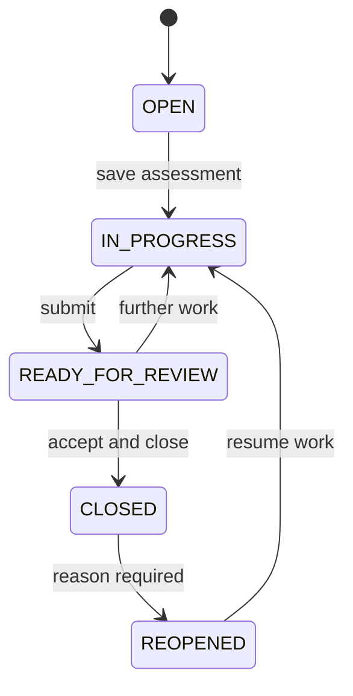

# Clarity IE remediation low-level design

## 1. Scope and design principles

The release repairs four connected domains: concerns, regulatory configuration, administrative controls and governance master data. The implementation retains the existing Cloudflare D1 and R2 architecture, platform identity, server-side authorisation and immutable audit chain.

The methodology remains limited assurance. A concern prompts proportionate enquiry, analytical review or targeted verification. It does not create an ISA audit assertion, mandatory sample or reasonable-assurance work programme.

## 2. Data model

### 2.1 `concerns` extensions

Add the following fields:

| Field | Type | Purpose |
|---|---|---|
| `reference` | text, unique | Stable human-readable finding reference |
| `source_type` | text | MANUAL, PROCEDURE or TB_ANALYTIC |
| `category` | text | GENERAL, ACCOUNTING_RECORDS, ACCOUNTS_COMPLIANCE, OTHER_MATTER or MATERIAL_SIGNIFICANCE |
| `management_response` | text | Management or trustee explanation |
| `examiner_conclusion` | text | Examiner's final assessment |
| `reporting_assessment` | text | UNDETERMINED, NO_REPORTING_EFFECT, RECORDS_CONCERN, ACCOUNTS_CONCERN, OTHER_MATTER or MATERIAL_SIGNIFICANCE |
| `submitted_by`, `submitted_at` | text | Review submission control |
| `reviewed_by`, `reviewed_at` | text | Review decision control |
| `review_conclusion` | text | Reviewer's documented decision |
| `closure_hash` | text | Immutable closure snapshot |
| `reopened_by`, `reopened_at`, `reopen_reason` | text | Controlled reopening history |
| `updated_at` | text | Register ordering and service metrics |

Permitted lifecycle:

Legacy `RESOLVED` records are mapped to the closed set for reporting and lock gates.

### 2.2 `concern_events`

Append-only concern activity:

- `id`, `concern_id`, `engagement_id`
- `event_type`: CREATED, INFORMATION, MANAGEMENT_RESPONSE, EXAMINER_ASSESSMENT, REVIEW_NOTE, SUBMITTED, FURTHER_WORK, CLOSED or REOPENED
- `body`
- `metadata` JSON text
- `actor_email`, `actor_name`, `created_at`

Events are inserted in the same action as the parent state change. They are never updated or deleted.

### 2.3 `documents`

Add nullable `concern_id` and an index. Upload validation confirms that the concern exists and belongs to the supplied engagement. Concern documents use `file_section = CONCERN_EVIDENCE` and remain internal.

### 2.4 `practice_settings`

One controlled record per practice deployment:

- `id = 1`
- `concern_review_mode`: ALL, HIGH_RISK_ONLY or EXAMINER_JUDGEMENT
- `require_independent_concern_closure`: boolean
- `allow_procedure_self_review`: boolean
- `default_quality_review_mode`: NONE, SECOND_REVIEW, HOT_FILE or COLD_FILE
- `file_lock_deadline_days`: integer, 1 to 365
- `retention_years`: integer, 1 to 25
- `updated_by`, `updated_at`

The migration inserts a default record. Reads never create or alter it.

## 3. Server actions

### 3.1 Concern actions

| Action | Permission | Validation | Result |
|---|---|---|---|
| `createConcern` | prepare | open engagement, required identity fields | OPEN concern plus CREATED event |
| `updateConcern` | prepare | status OPEN, IN_PROGRESS or REOPENED | persists assessment, sets IN_PROGRESS, appends material update event |
| `addConcernEvent` | prepare/review | non-empty controlled event type | append-only timeline event |
| `submitConcernForReview` | prepare | targeted work, conclusion and reporting assessment | READY_FOR_REVIEW plus snapshot and event |
| `reviewConcern` | review | READY_FOR_REVIEW, decision and review conclusion | CLOSED or IN_PROGRESS plus event and closure snapshot |
| `reopenConcern` | review | closed status and reason | REOPENED plus event |

All actions first resolve the concern, then the engagement, then call the engagement-open and authorisation checks. The independent-review policy is evaluated only when closing.

### 3.2 Rule administration actions

`createJurisdictionRuleSet` accepts explicit `sourceRuleSetId`, `version` and `effectiveFrom`. The source must belong to the jurisdiction. `saveAndPublishJurisdictionRuleSet` validates and writes the submitted form and publication state as one logical action. It rejects duplicate versions and overlaps, determines a single eligible predecessor and closes that predecessor immediately before the new period. Historical engagement foreign keys are not modified.

`updateJurisdiction` rejects deactivation when an unlocked or non-signed engagement uses the jurisdiction.

### 3.3 Quality settings action

`updatePracticeSettings` is restricted to practice administration. It validates enums and numeric ranges, updates row 1 and appends an audit event. The client state response excludes the settings record.

## 4. Reporting consistency rules

`closedConcernStatuses = {CLOSED, RESOLVED}`.

`openConcernStatuses = all other statuses`.

The reporting conclusion is compatible when:

- UNMODIFIED: every closed concern has NO_REPORTING_EFFECT and no concern is open.
- RECORDS_CONCERN: at least one closed concern is assessed as RECORDS_CONCERN.
- ACCOUNTS_CONCERN: at least one closed concern is assessed as ACCOUNTS_CONCERN.
- OTHER_MATTER: at least one closed concern is assessed as OTHER_MATTER.
- Material-significance concerns require the material-significance gate and must be disclosed in the controlled findings summary; they do not by themselves map to one statutory report conclusion.

The same compatibility function is used by the UI, report API and file-lock action to prevent divergent behaviour.

## 5. Interface design

### 5.1 Findings & concerns workspace

The workspace uses a master-detail layout:

- Header: selected engagement, counts and create action.
- Filter bar: search, status, severity and category.
- Register: stable reference, title, source, owner, status, assessment and last activity.
- Detail: summary, editable assessment, activity timeline, evidence, submission and review controls.

Mobile presentation collapses to a register followed by the selected concern. No horizontal form grids are required below 720 px.

### 5.2 Annual file integration

The annual-file concern card becomes a summary with a direct Open register action. It shows open, awaiting-review and closed counts. It no longer contains a compressed two-textarea closure form.

### 5.3 Administration

- Every tab contains persistent actions, row-level feedback and deterministic lists.
- Draft publication is performed from the visible form, preventing stale-field publication.
- The Quality controls tab becomes an editable policy form.
- Overview exceptions link directly to the affected administrative tab.

## 6. Security and integrity

1. Concern uploads inherit file signature validation, rate limiting, R2 storage and download authorisation.
2. Client state contains no concern records, events, internal evidence or practice settings.
3. Submitted and closed snapshots are SHA-256 hashes over the complete controlled record.
4. Every material concern and administration action is written to the existing hash-chained audit stream.
5. Locked engagements reject concern changes and uploads.

## 7. Test design and traceability

### Unit and contract tests

- concern lifecycle transitions and required fields
- report-conclusion compatibility
- rule-series overlap, predecessor and duplicate-version logic
- quality settings validation
- authorisation for every new action
- state exclusion for client users

### Workflow tests

- create, edit, reload, submit, request further work, resubmit, close and reopen a concern
- upload and retrieve concern evidence
- edit a rule and publish the exact visible values
- reject an overlapping or duplicate rule
- retain an engagement's pinned rule after publication
- edit trustee/officer cessation data and reload
- edit each administration tab and verify persistence

### Visual and interaction tests

- desktop and mobile concern master-detail layout
- keyboard access and visible labels for all controls
- pending, success and error feedback
- no clipped buttons, overlapping fields or inaccessible off-screen actions

